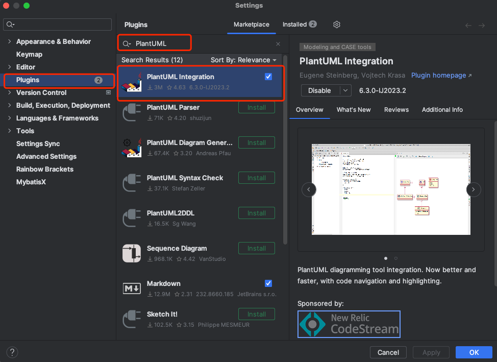

# Plant UML

- [Plant UML](#plant-uml)
  - [1. 安装](#1-安装)
    - [1.1. 安装 GraphViz 组件](#11-安装-graphviz-组件)
      - [Windows 安装](#windows-安装)
      - [Linux 安装](#linux-安装)
      - [macOS 安装](#macos-安装)
    - [1.2. 安装 Plant UML 插件](#12-安装-plant-uml-插件)
      - [VSCode](#vscode)
      - [Intellj IDEs](#intellj-ides)
  - [2. 使用](#2-使用)

---

## 1. 安装

### 1.1. 安装 GraphViz 组件

`GraphViz` 组件用于绘制图形, Plant UML 的运行需要依赖该组件

#### Windows 安装

Windows 版本自带 `dot.exe` 组件, 无需单独安装

#### Linux 安装

```bash
sudo yum install graphviz
```

或者

```bash
sudo apt install graphviz
```

#### macOS 安装

```bash
brew install libtool
brew link libtool
brew install graphviz
brew link --overwrite graphviz
```

### 1.2. 安装 Plant UML 插件

PlantUML 有一个可以独立安装的软件, 但使用起来并不方便

VSCode 和 Intellj IDEs 都具备对应的插件可以使用

#### VSCode

安装如下插件


#### Intellj IDEs

安装如下插件



## 2. 使用

参考 [C4 Model](https://github.com/plantuml-stdlib/C4-PlantUML)
